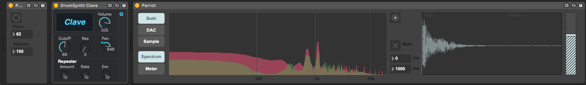

# Parrot

Parrot is a [Max for Live](https://www.ableton.com/en/live/max-for-live/) analyzer designed to assist in recreating sampled sounds with a synthesizer.

It overlays the spectral output of an instrument (for example, a synthesizer) and a sample. The idea is to then manually manipulate the synthesizer until the spectral output matches the sample.  For example, to synthesize a snare drum, you'd setup a snare sample in Parrot and adjust your synthesizer until its spectral output matches the sample.

The technique of using the spectral output of a sound to replicate it through synthesis is inspired by [*Welsh's Synthesizer Cookbook*](http://synthesizer-cookbook.com/).

## Details

Parrot includes two Max for Live patches: **Parrot** and **ParrotNote**.

### Parrot

Parrot is a Max for Live *audio effect* that includes the main interface with sample playback controls, and the overlaid spectral output.

### ParrotNote

ParrotNote is a Max for Live *MIDI effect* that routes the incoming MIDI note to the Parrot audio effect so that it can play the sample at the same time that the synthesizer receives the incoming MIDI note. In other words, ParrotNote works around the fact that Max for Live audio effects cannot receive MIDI input directly.

## Setup

1. Insert **ParrotNote** to the left of an instrument on a MIDI channel.
2. Insert **Parrot** to the right of the instrument.
3. Load a sample by dragging it onto the waveform box.
4. When playing a MIDI note plays, the spectral output in Parrot will show the output of the synthesizer overlaid with the output of the sample.

## Interface

### ParrotNote

ParrotNote's interface shows the pitch and velocity of the most recent MIDI note. The button outputs the MIDI note. The duration of the note can also be set.

### Parrot

#### Analyzer

- `Both` / `DAC` / `Sample`: Select whether to overlay the DAC and Sample (`Both`), or display only the DAC or sample.

#### Sample Playback

- To load a sample, drag it onto the waveform box.
- `Attack`: The sample envelope attack.
- `Decay`: The sample envelope decay.
- `Gain`: The sample playback volume.
- The button plays the sample.
- `Mute`: Toggle whether the sample's audio is output.
- `Clear`: Clear the sample.

#### Standalone Mode

Parrot can also be opened in standalone mode by opening the `misc/instruments/Parrot.maxpat`  outside of Ableton Live, it offers some additional features.

- Typing the `s` will play the sample
- **BG**: Toggle whether typing `s` should also play the sample when Max is not in the foreground
