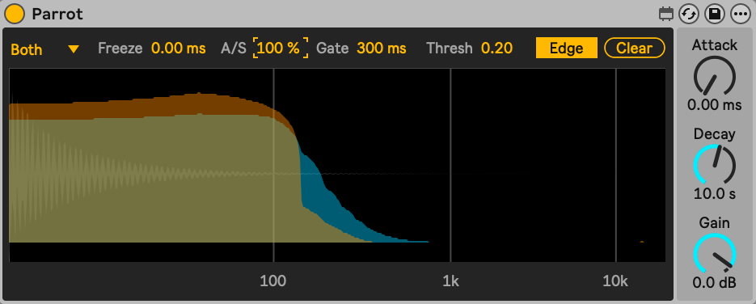

# Parrot

Parrot is a [Max for Live](https://www.ableton.com/en/live/max-for-live/) audio effect to assist in recreating sampled sounds with a synthesizer.

It overlays the spectral output of an instrument (e.g., a synthesizer) over a sample. The idea is to then manually manipulate the controls of the synthesizer until the spectral output matches the sample. For example, to synthesize a snare drum, you'd add a snare sample to Parrot and then adjust the synthesizer until the spectral output matches the sample.

The technique of using the spectral output of a sound to replicate it through synthesis is inspired by [*Welsh's Synthesizer Cookbook*](http://synthesizer-cookbook.com/).

### Parrot

Parrot plays back the sample when the audio effect input goes from silence to audible, Parrot itself does not change the input audio at all, and only offers attack and decay controls for the sample.

## Setup

1. Add **Parrot** as an Audio Effect.
2. Add a sample by dragging it onto the sample drop target.
3. When Parrot detects audio input (its audio input goes from silence to audible), it will play back the sample and overlay the spectral output of the input sound and the sample.

## Installation

### Freezing the Devices

Before the device is added to the `User Library` in Ableton Live or Ableton Push, the device (`.amxd`) should be frozen.

The latest version of the frozen device can be downloaded from [the Parrot page on the Max for Live site](https://maxforlive.com/library/device/5797/parrot).

The device can be frozen manually by following these steps:

1. Click the disclosure icon in the upper right of each device and choose `Edit in Max`.
2. In the Max window, click the `Freeze Device` icon in the bottom bar that looks like a snow flake, then choose `File > Save As...` to save the frozen device to a temporary location.

Note that the frozen files can be deleted after the device has been added to the `User Library`.

### Installing in Ableton Live

Drag the frozen `Parrot.amxd` to `Ableton/User Library/Presets/Audio Effects/Max Audio Effect/`

### Standalone Mode

Parrot can also be opened in standalone mode by opening the `Parrot/Parrot.maxpat` outside of Ableton Live.

## Interface

The input audio is shown green in the graph, and the sample is shown orange.

- `Both` / `Audio` / `Sample`: Select whether to overlay the audio and sample (`Both`), or display only the audio or the sample.
- `Freeze`: Number of milliseconds to freeze the output of the spectral analyzer after (`0` disables freezing).
- `A/S`: Cross fade between audio and sample (`0` outputs only audio; `50` outputs half audio, half sample; `100` outputs only sample).
- `Clear`: Clear the sample.
- `Attack`: The sample envelope attack.
- `Decay`: The sample envelope decay.
- `Gain`: The sample playback volume.

### Transient Detection

Parrot has several controls that work together to determine when a transient is detected to replay the loaded sample. **Edge** is the simplest approach, but only relying on it means the sample will never retrigger until the sample has finished playing (i.e., its amplitude has gone to `0`). **Gate** and **Thresh** allow detecting a transient (sudden increase in amplitude) in order to replay the sample more frequently.

- **Gate:** Minimum amount before the sample is allowed to play again.
- **Thresh:** Threshold for detecting a transient in the delta between samples. A **Thresh** of `0` disables transient detection entirely.
- **Edge:** Toggles whether to *always* play the sample when a `0` to `1` amplitude is detected.
