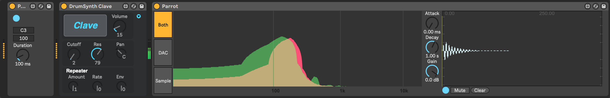

# Parrot

Parrot is a [Max for Live](https://www.ableton.com/en/live/max-for-live/) analyzer that overlays the spectral output of an instrument (e.g., a synthesizer) with a sample. The idea is to help when synthesizing the sound of a sample, for example to making a synthesized snare drum that sounds like a snare drum sample. The idea is to adjust the parameters of synthesizer until the spectral output of the synthesizer and the samples match.

## Details

Parrot creates has two Max for Live patches: Parrot and ParrotNote.

### Parrot

Parrot is a Max for Live audio effect that includes the main interface with sample playback controls and the overlaid spectral output.

## ParrotNote

ParrotNote is a Max for Live MIDI effect that simply routes the note to the Parrot instrument, since Max for Live audio effects cannot receive midi input themselves.

